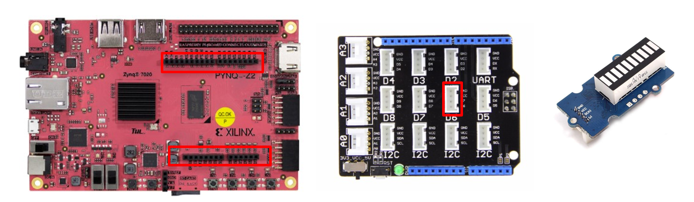

# Grove LED Bar Example

这个样例展示了如何使用[Grove LED Bar](http://www.seeedstudio.com/depot/Grove-LED-Bar-v20-p-2474.html). 

Grove LED bar有10个LED灯，8个绿色的LED，一个橘黄色的LED和一个红色的LED。每个LED的亮度都可以独立被控制。

在这个notebook中，我们需要一块Arduino Shield，LED bar将会被连接在接口板的G4接口上。

如果你手上使用的是如下图所示Seeed的Base Shield，那么LED bar将会连接在连接板的D6接口上。




```python
# Make sure the base overlay is loaded
from pynq.overlays.base import BaseOverlay
base = BaseOverlay("base.bit")
```

### 1. 实例化LED bar控制器并复位


```python
from pynq.lib.arduino import Grove_LEDbar
from pynq.lib.arduino import ARDUINO_GROVE_G4

# Instantiate Grove LED Bar on Arduino shield G4
ledbar = Grove_LEDbar(base.ARDUINO,ARDUINO_GROVE_G4)
ledbar.reset()
```

### 2. 单独打开关闭LED灯
写入一个10bit的二进制模式，就可以单独控制每个led灯的亮灭了。 1 = on, 0 = off


```python
from time import sleep

# Light up different bars in a loop
for i in range(2):
    ledbar.write_binary(0b1010100000)
    sleep(0.5)
    ledbar.write_binary(0b0000100100)
    sleep(0.5)
    ledbar.write_binary(0b1010101110)
    sleep(0.5)
    ledbar.write_binary(0b1111111110)
    sleep(0.5)
```

### 3. 单独设置每个LED的亮度

每个LED的亮度都可以被单独设置，8bit寄存器控制的亮度范围为0~0xff。


```python
# Brightness 0-255
HIGH = 0xFF
MED  = 0xAA
LOW  = 0x01
OFF  = 0X00

brightness = [OFF, OFF, OFF, LOW, LOW, MED, MED, HIGH, HIGH, HIGH]

ledbar.write_brightness(0b1111111111,brightness)
```

### 4.  控制LED灯亮的数量

我们可以控制一连排LED灯亮的数量，可以从红色端开始亮，也可以从绿色端开始数。


write_level(level, bright_level, green_to_red)

* level is the number of LEDs that are on.
* bright_level [0-10] is the level of brightness
* green_to_red = 1 means the LEDs start being lit from the "green" end of the LED bar
* green_to_red = 0 means the LEDs start being lit from the "red" end of the LED bar.

举个例子，ledbar.write_level(5,4,1)会点亮5个LED灯，亮度是4，从绿色短开始计数。


```python
for i in range (1,11):
    ledbar.write_level(i,3,0)
    sleep(0.3)
for i in range (1,10):
    ledbar.write_level(i,3,1)
    sleep(0.3)    
```

### 5. 用板载按键来控制LED bar

这个单元格展示了如何利用板载按键来控制LED bar的亮条长度 

* Button 0 to increase level
* Button 1 to decrease level
* Button 3 to exit


```python
btns = [base.buttons[index] for index in range(4)] 
i = 1
ledbar.reset()

done = False
while not done:
    if (btns[0].read()==1):
        sleep(0.2)
        ledbar.write_level(i,2,1)
        i = min(i+1,9)
    elif (btns[1].read()==1):
        sleep(0.2)
        i = max(i-1,0)
        ledbar.write_level(i,2,1)
    elif (btns[3].read()==1):
        ledbar.reset()
        done = True
```
