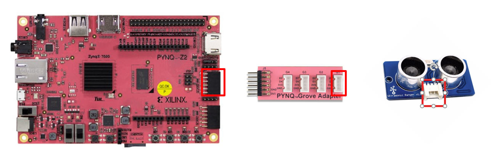

# 超声波测距仪传感器
这个例子展示了如何使用 
[超声波测距仪传感器](https://www.seeedstudio.com/Grove---Ultrasonic-Ranger-p-960.html)。它的测量最大范围为400cm，测量最小范围是3cm，分辨率为1cm。

如果没有障碍物，则会默认返回500cm。

在这个notebook里，我们只展示如何控制grove ultrasonic ranger连接到Pmod接口上，因此需要一个pmod grove和转换器。当然读者也可以自己把控制移植到Arduino接口的版本上去。




```python
from pynq.overlays.base import BaseOverlay

base = BaseOverlay("base.bit")
```


### 1. 使用 Microblaze 去控制超声波传感器
下面的程序假设超声波传感器是连接在Pmod-Grove转接器的G1接口上的，以及该转接器连接在PMODA接口上。

时钟控制器的寄存器分布如下：

|Register name |Register functionality               |Register value |
|:-------------|:------------------------------------|:----------------|
|TCSR0         |Timer 0 Control and Status Register  |0x00             |
|TLR0          |Timer 0 Load Register                |0x04             |
|TCR0          |Timer 0 Counter Register             |0x08             |
|TCSR1         |Timer 1 Control and Status Register  |0x10             |
|TLR1          |Timer 1 Load Register                |0x14             |
|TCR1          |Timer 1 Counter Register             |0x18             |


```python
%%microblaze base.PMODA

#include "xparameters.h"
#include "xtmrctr.h"
#include "gpio.h"
#include "timer.h"
#include <pmod_grove.h>

#define TCSR0 0x00
#define TLR0 0x04
#define TCR0 0x08
#define TCSR1 0x10
#define TLR1 0x14
#define TCR1 0x18
#define MAX_COUNT 0xFFFFFFFF

void create_10us_pulse(gpio usranger){
    gpio_set_direction(usranger, GPIO_OUT);
    gpio_write(usranger, 0);
    delay_us(2);
    gpio_write(usranger, 1);
    delay_us(10);
    gpio_write(usranger, 0);
}

void configure_as_input(gpio usranger){
    gpio_set_direction(usranger, GPIO_IN);
}

unsigned int capture_duration(gpio usranger){
    unsigned int count1, count2;
    count1=0;
    count2=0;
    XTmrCtr_WriteReg(XPAR_TMRCTR_0_BASEADDR, 0, TLR0, 0x0);
    XTmrCtr_WriteReg(XPAR_TMRCTR_0_BASEADDR, 0, TCSR0, 0x190);
    while(!gpio_read(usranger));
    count1=XTmrCtr_ReadReg(XPAR_TMRCTR_0_BASEADDR, 0, TCR0);
    while(gpio_read(usranger));
    count2=XTmrCtr_ReadReg(XPAR_TMRCTR_0_BASEADDR, 0, TCR0);
    if(count2 > count1) {
        return (count2 - count1);
    } else {
        return((MAX_COUNT - count1) + count2);  
    }
}

unsigned int read_raw(){
    gpio usranger;
    usranger = gpio_open(PMOD_G1_A);
    create_10us_pulse(usranger);
    configure_as_input(usranger);
    return capture_duration(usranger);
}
```

### 2. 测量距离

记住放一些障碍物在传感器面前，否则它将返回默认的500cm。


```python
from pynq import Clocks

def read_distance_cm():
    raw_value = read_raw()
    clk_period_ns = int(1000 / Clocks.fclk0_mhz)
    num_microseconds = raw_value * clk_period_ns * 0.001
    if num_microseconds * 0.001 > 30:
        return 500
    else:
        return num_microseconds/58
```


```python
read_distance_cm()
```


    11.873448275862069


